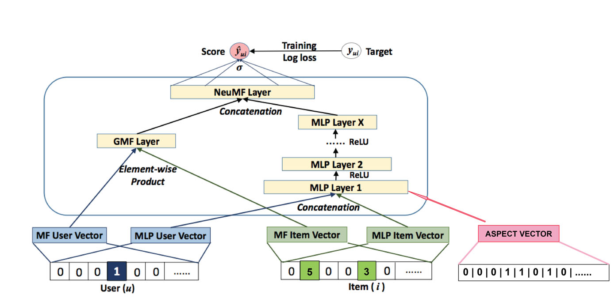

# Neural Collaborative Filtering

## Citation
* [[1] X. He, L. Liao, H. Zhang, L. Nie, X. Hu, and T.-S. Chua, "Neural collaborative filtering," in Proceedings of the 26th international conference on world wide web, 2017, pp. 173-182.](https://dl.acm.org/doi/10.1145/3038912.3052569)

## Methodology
In this segment of the FYP, we aim to use the quantified values from Aspect based sentiment analysis from the previous segment using another dataset and build a recommender system from it using NCF.
I referenced the paper by published by X. He, L. Liao, H. Zhang, L. Nie, X. Hu, and T.-S. Chua [1] and used it as a base to generate my models.

### Vector Inclusive NCF

For my recommender system, it needed to account for the aspect element as shown from the previous experiment - Aspect based sentiment Analysis. Hence, aspect vector is added for the model to learn the interaction between items, users and aspects. 

### Vector Inclusive Regression NCF

This is similar to the previous example, however rather than leaving the item vector in binary, I left the original values in a range of 1 to 5 with an interval of 1.

## Results
For the evaluation, we used precision @ 10 instead of accuracy to evaluate the results

Models | Precision @ 10 
--- | --- 
NCF| 0.71 |
VI-NCF | 0.78 |
NIR-NCF | 0.84 |

## Dataset used
* MovieLens 1 Million dataset